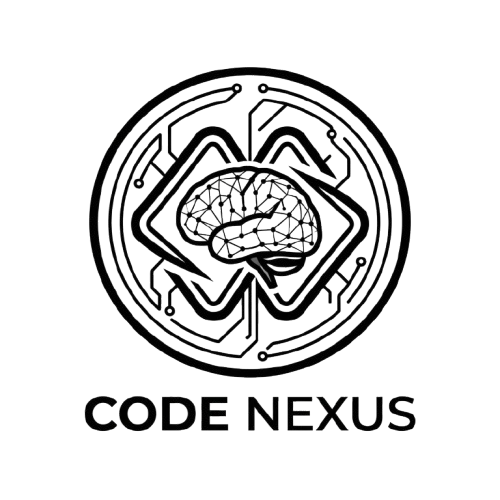

<p align="center">
  
</p>

<h1 align="center">CodeNexus — AI-Powered Browser-Based Code Editor</h1>

<p align="center">
  A complete development environment that runs entirely in your browser.<br/>
  Powered by WebContainer technology for secure client-side code execution.
</p>

<p align="center">
  
  
  
  
  
</p>

---

## Table of Contents

- [Overview](#overview)
- [Features](#features)
- [Architecture](#architecture)
- [Tech Stack](#tech-stack)
- [Project Structure](#project-structure)
- [Getting Started](#getting-started)
- [Configuration](#configuration)
- [Scripts Reference](#scripts-reference)
- [Testing](#testing)
- [Docker Deployment](#docker-deployment)
- [API Routes](#api-routes)
- [State Management](#state-management)
- [Backend Integration](#backend-integration)
- [Security](#security)
- [Known Limitations](#known-limitations)
- [Troubleshooting](#troubleshooting)
- [License](#license)

---

## Overview

**CodeNexus** is a full-featured, AI-powered code editor that runs entirely inside the browser. It combines a multi-tab code editor, an integrated terminal, live preview, AI chat assistance, and deep codebase analytics — all without requiring users to install anything locally.

The frontend is a **Remix** application deployed to **Cloudflare Pages**. Code execution happens client-side via the **WebContainer API**, which provides a sandboxed Node.js environment directly in the browser. Advanced analytics features (git mining, SCIP-based intelligence, dependency graphs) are powered by a companion **Spring Boot backend**.

---

## Features

### Intelligent Code Editor

- **Multi-tab interface** with syntax highlighting via CodeMirror (JavaScript, TypeScript, Python, Java, C++, HTML, CSS, JSON, Markdown, Vue, WASM)
- **File tree navigator** with context menus, file search, and file-lock management
- **Side-by-side diff viewer** for comparing file changes
- **Live preview** of running web applications (hot-reload via WebContainer)
- **Binary file handling** with Base64 encoding support

### AI-Powered Assistance

- **Context-aware chat** that understands your entire codebase
- **15+ AI providers**: OpenAI, Anthropic (Claude), Google Gemini, Groq, Ollama, Mistral, DeepSeek, Cohere, HuggingFace, OpenRouter, Together AI, Perplexity, xAI, Amazon Bedrock, LM Studio
- **Parser-only and LLM-enhanced modes** via Tree-Sitter + Vercel AI SDK
- **Artifact system**: AI generates `<mindvexArtifact>` tags for code and `<mindvexAction>` tags for file/shell operations, executed automatically
- **Prompt enhancement** for generating better AI responses

### Code Intelligence Tools

- **Knowledge Graph** — Interactive 2D/3D force-directed graph visualizing file and symbol dependencies
- **Architecture Diagram** — SVG-based drag-and-drop architecture viewer with AI and offline layering modes
- **Cycle Detection** — DFS-based circular dependency identification with optional LLM insights
- **Impact Analysis** — Change propagation analysis with risk scoring across modules
- **AI Code Reasoning** — Deep architectural analysis detecting design patterns, anti-patterns, and refactoring opportunities
- **Evolutionary Blame** — Git blame visualization showing who changed what, when, and how often
- **Code Health Heatmap** — Visual file-level code quality indicators

### Living Wiki

- **Auto-generated documentation**: README, ADR (Architecture Decision Records), API Reference
- **Multiple renderers**: Markdown, JSON tree, diagram generation
- **PDF export** support
- **Preserve-or-Update logic** that respects existing README content instead of overwriting it

### Project Analytics Dashboard

- Git history mining with **hotspot detection** and commit frequency analysis
- **SCIP-based code intelligence**: hover info, find-all-references, go-to-definition
- **File-level churn trends** showing change patterns over time
- Dependency graph construction and visualization

### Integrated Development Tools

- **In-browser terminal** (Xterm.js) with multiple tab support
- **Git integration** via Isomorphic-Git — clone, commit, push, pull
- **One-click deployment** to GitHub, Netlify, and Vercel
- **GitHub & GitLab** OAuth connections with repository browsing

### Modern UI

- **Dark/Light themes** with orange accent palette
- **Responsive design** with mobile detection
- **Component library**: Radix UI, Headless UI, Framer Motion animations
- **Icon sets**: Lucide, Phosphor Icons, Heroicons
- **Drag-and-drop** support via React DnD

---

## Architecture

```
┌────────────────────────────────────────────────────────────┐
│                     Cloudflare Pages                        │
│  ┌──────────────────────────────────────────────────────┐  │
│  │              Remix Application (SSR/CSR)              │  │
│  │                                                      │  │
│  │  ┌─────────┐  ┌──────────┐  ┌────────────────────┐  │  │
│  │  │  Editor  │  │ Terminal  │  │   AI Chat Engine   │  │  │
│  │  │CodeMirror│  │ Xterm.js  │  │  Vercel AI SDK     │  │  │
│  │  └────┬─────┘  └────┬─────┘  └────────┬───────────┘  │  │
│  │       │              │                  │              │  │
│  │  ┌────▼──────────────▼──────────────────▼───────────┐ │  │
│  │  │            WebContainer API (Sandbox)             │ │  │
│  │  │        Browser-based Node.js runtime              │ │  │
│  │  └──────────────────────────────────────────────────┘ │  │
│  │                                                      │  │
│  │  ┌─────────────┐  ┌──────────┐  ┌────────────────┐  │  │
│  │  │  Nanostores  │  │ IndexedDB │  │  localStorage  │  │  │
│  │  │    State     │  │  History  │  │  Auth/Prefs    │  │  │
│  │  └─────────────┘  └──────────┘  └────────────────┘  │  │
│  └──────────────────────────┬───────────────────────────┘  │
└─────────────────────────────┼──────────────────────────────┘
                              │ REST / WebSocket
                              ▼
              ┌───────────────────────────────┐
              │   Spring Boot Backend (8080)   │
              │   PostgreSQL + pgvector        │
              │   SCIP · JGit · Gemini AI      │
              └───────────────────────────────┘
```

---

## Tech Stack

| Category                 | Technologies                                                                                                                                               |
| ------------------------ | ---------------------------------------------------------------------------------------------------------------------------------------------------------- |
| **Framework**            | Remix 2.15.2 + Vite + TypeScript (ESNext)                                                                                                                  |
| **Runtime / Deployment** | Cloudflare Pages / Workers (Wrangler)                                                                                                                      |
| **Code Editor**          | CodeMirror 6 with VS Code theme                                                                                                                            |
| **Code Execution**       | WebContainer API 1.6.1 (in-browser Node.js)                                                                                                                |
| **AI / LLM**             | Vercel AI SDK 4.3 — OpenAI, Anthropic, Google, Groq, Ollama, Mistral, Cohere, DeepSeek, HuggingFace, OpenRouter, Together, Perplexity, xAI, Amazon Bedrock |
| **Parsing**              | Tree-Sitter (WASM) for language-aware analysis                                                                                                             |
| **State Management**     | Nanostores 0.10 + Zustand 5.0                                                                                                                              |
| **UI Components**        | Radix UI, Headless UI 2.2, Framer Motion 11.12                                                                                                             |
| **Styling**              | UnoCSS (atomic) + Tailwind CSS + SCSS                                                                                                                      |
| **Icons**                | Lucide, Phosphor Icons, Heroicons                                                                                                                          |
| **Terminal**             | Xterm.js 5.5 with fit and web-links addons                                                                                                                 |
| **Git**                  | Isomorphic-Git 1.27 + Octokit REST 21.0                                                                                                                    |
| **Visualization**        | Cytoscape 3.33, Force-Graph (2D/3D), Three.js 0.183, Recharts 3.7, Chart.js 4.4                                                                            |
| **Validation**           | Zod 3.24                                                                                                                                                   |
| **Testing**              | Vitest (unit) + Playwright 1.58 (E2E)                                                                                                                      |
| **Linting**              | ESLint (@blitz plugin) + Prettier                                                                                                                          |
| **Real-time**            | STOMP.js 7.3 (WebSocket)                                                                                                                                   |
| **Build**                | Vite + ESBuild minification                                                                                                                                |

---

## Project Structure

```
MindVex_Editor/
├── app/
│   ├── root.tsx                      # App entry — layout, providers, theme, fonts
│   ├── entry.client.tsx              # Client-side hydration
│   ├── entry.server.tsx              # Server-side rendering
│   ├── routes/                       # Remix file-based routing
│   │   ├── _index.tsx                # Home page (login gate, repo history)
│   │   ├── editor.tsx                # Code editor workspace
│   │   ├── dashboard.tsx             # Analytics dashboard
│   │   ├── git.tsx                   # Git URL import page
│   │   ├── import.tsx                # Local folder import
│   │   ├── auth.callback.tsx         # OAuth callback handler
│   │   ├── api.health.ts             # Health check endpoint
│   │   ├── api.github-*.ts           # GitHub API proxies
│   │   ├── api.netlify-deploy.ts     # Netlify deployment
│   │   ├── api.vercel-deploy.ts      # Vercel deployment
│   │   └── ...                       # 20+ route files
│   ├── components/
│   │   ├── header/                   # App header with branding and actions
│   │   ├── sidebar/                  # Navigation menu, chat history
│   │   ├── editor/                   # CodeMirror editor integration
│   │   ├── workbench/                # Main workspace
│   │   │   ├── Workbench.client.tsx  # Workbench layout controller
│   │   │   ├── EditorPanel.tsx       # Editor view
│   │   │   ├── Preview.tsx           # Live preview panel
│   │   │   ├── DiffView.tsx          # Diff visualization
│   │   │   ├── FileTree.tsx          # File navigator
│   │   │   ├── Search.tsx            # File search
│   │   │   ├── IntelligentChat.tsx   # AI chat interface
│   │   │   ├── LivingWiki.tsx        # Documentation generator/viewer
│   │   │   ├── MarkdownRenderer.tsx  # GitHub-style Markdown rendering
│   │   │   ├── AnalyticsDashboard.tsx
│   │   │   ├── EvolutionaryBlame.tsx
│   │   │   ├── CodeHealthHeatmap.tsx
│   │   │   ├── terminal/             # Terminal emulator (multi-tab)
│   │   │   └── tools/                # Code intelligence tools
│   │   │       ├── AICodeReasoning.tsx
│   │   │       ├── ArchitectureDiagram.tsx
│   │   │       ├── KnowledgeGraphPage.tsx
│   │   │       ├── CycleDetectionPage.tsx
│   │   │       ├── ImpactAnalysisPage.tsx
│   │   │       └── RealTimeGraphPage.tsx
│   │   ├── auth/                     # Login modal, GitHub OAuth button
│   │   ├── dashboard/                # Analytics dashboard view
│   │   ├── deploy/                   # Deployment dialogs
│   │   ├── git/                      # Git URL import component
│   │   ├── home/                     # Home page content, repo browser
│   │   ├── import/                   # Folder import interface
│   │   ├── @settings/                # Settings panel with tabs
│   │   └── ui/                       # Reusable UI component library
│   ├── lib/
│   │   ├── stores/                   # State management (Nanostores)
│   │   ├── api/                      # API clients (backend, connections)
│   │   ├── hooks/                    # Custom React hooks (15+)
│   │   ├── runtime/                  # AI action execution engine
│   │   ├── persistence/              # IndexedDB & localStorage
│   │   ├── webcontainer/             # WebContainer initialization
│   │   ├── unifiedParser/            # Tree-Sitter + AI analysis
│   │   ├── analytics/                # Backend analytics API client
│   │   ├── graph/                    # Dependency graph API client
│   │   ├── scip/                     # SCIP code intelligence client
│   │   ├── mcp/                      # MCP protocol client
│   │   ├── crypto.ts                 # AES-CBC encryption
│   │   └── security.ts              # Security utilities
│   ├── utils/                        # 25+ utility modules
│   ├── types/                        # TypeScript type definitions
│   └── styles/                       # Global SCSS + component styles
├── public/                           # Static assets (favicon, icons)
├── icons/                            # SVG icons for UnoCSS icon collection
├── assets/                           # Application assets (logos)
├── scripts/                          # Build & setup scripts
├── tests/
│   ├── e2e/                          # Playwright E2E tests
│   └── unit/                         # Vitest unit tests
├── docs/                             # Feature documentation
├── vite.config.ts                    # Vite + Remix build config
├── uno.config.ts                     # UnoCSS theme & icon config
├── tsconfig.json                     # TypeScript config (ESNext, strict)
├── wrangler.toml                     # Cloudflare Pages config
├── eslint.config.mjs                 # ESLint rules
├── playwright.config.ts              # E2E test config
├── Dockerfile                        # Multi-stage Docker build
├── docker-compose.yaml               # Dev/prod container setup
└── package.json                      # Dependencies & scripts
```

---

## Getting Started

### Prerequisites

- **Node.js** 22+ (LTS recommended)
- **pnpm** 9.x (preferred) or npm
- A modern browser (Chrome, Edge, Firefox — WebContainer requires cross-origin isolation)

### Installation

```bash
# Clone the repository
git clone <repository-url>
cd MindVex_Editor

# Install dependencies (pnpm recommended)
pnpm install

# Start the development server
pnpm run dev
```

The app will be available at the URL printed by Vite (typically `http://localhost:5173`).

> **Note:** For backend-powered features (analytics, git mining, SCIP, dependency graphs), also start the [MindVex_Editor_Backend](../MindVex_Editor_Backend/README.md).

### Using npm (alternative)

```bash
npm install --legacy-peer-deps
npm run dev
```

---

## Configuration

### Environment Variables

Configure AI providers and backend connection via environment variables or the in-app **Settings** panel.

| Variable                       | Description                                                                | Required      |
| ------------------------------ | -------------------------------------------------------------------------- | ------------- |
| `VITE_BACKEND_URL`             | Spring Boot backend URL (e.g., `https://mindvex-backend.onrender.com/api`) | For analytics |
| `ANTHROPIC_API_KEY`            | Anthropic Claude API key                                                   | Optional      |
| `OPENAI_API_KEY`               | OpenAI GPT API key                                                         | Optional      |
| `GOOGLE_GENERATIVE_AI_API_KEY` | Google Gemini API key                                                      | Optional      |
| `GROQ_API_KEY`                 | Groq API key                                                               | Optional      |
| `OLLAMA_API_BASE_URL`          | Ollama local server URL                                                    | Optional      |
| `MISTRAL_API_KEY`              | Mistral API key                                                            | Optional      |
| `DEEPSEEK_API_KEY`             | DeepSeek API key                                                           | Optional      |
| `HuggingFace_API_KEY`          | HuggingFace API key                                                        | Optional      |
| `OPEN_ROUTER_API_KEY`          | OpenRouter API key                                                         | Optional      |
| `TOGETHER_API_KEY`             | Together AI API key                                                        | Optional      |
| `PERPLEXITY_API_KEY`           | Perplexity API key                                                         | Optional      |
| `XAI_API_KEY`                  | xAI API key                                                                | Optional      |
| `AWS_BEDROCK_CONFIG`           | Amazon Bedrock configuration                                               | Optional      |
| `LMSTUDIO_API_BASE_URL`        | LM Studio local server URL                                                 | Optional      |
| `OPENAI_LIKE_API_KEY`          | OpenAI-compatible provider key                                             | Optional      |
| `OPENAI_LIKE_API_BASE_URL`     | OpenAI-compatible provider URL                                             | Optional      |

### Cloudflare Deployment (`wrangler.toml`)

```toml
name = "mindvex"
compatibility_flags = ["nodejs_compat"]
compatibility_date = "2025-03-28"
pages_build_output_dir = "./build/client"

[vars]
VITE_BACKEND_URL = "https://mindvex-backend.onrender.com/api"
```

---

## Scripts Reference

| Script               | Description                                          |
| -------------------- | ---------------------------------------------------- |
| `pnpm run dev`       | Start development server with hot module replacement |
| `pnpm run build`     | Production build via Remix + Vite                    |
| `pnpm run deploy`    | Build and deploy to Cloudflare Pages                 |
| `pnpm run start`     | Run locally with Wrangler (post-build)               |
| `pnpm run test`      | Run unit tests (Vitest)                              |
| `pnpm run test:e2e`  | Run E2E tests (Playwright)                           |
| `pnpm run test:all`  | Run both unit and E2E tests                          |
| `pnpm run lint`      | Lint with ESLint                                     |
| `pnpm run lint:fix`  | Auto-fix lint issues + Prettier formatting           |
| `pnpm run typecheck` | TypeScript type checking (`tsc`)                     |

---

## Testing

### Unit Tests (Vitest)

```bash
pnpm run test           # Run once
pnpm run test:watch     # Watch mode
pnpm run test:unit      # Unit tests only
```

- **Environment**: jsdom
- **Location**: `tests/unit/` and `app/**/*.spec.ts`
- Tests cover component rendering and store behavior

### E2E Tests (Playwright)

```bash
pnpm run test:e2e         # Headless
pnpm run test:e2e:headed  # With browser UI
pnpm run test:e2e:ui      # Playwright UI mode
```

- **Browsers**: Chromium, Firefox, WebKit
- **Mobile viewports**: Pixel 5, iPhone 12
- **Reports**: HTML report generated in `playwright-report/`
- **Artifacts**: Video and screenshots captured on test failure
- Automatically starts the dev server before running

---

## Docker Deployment

### Production Build

```bash
docker compose --profile prod up --build
```

### Development (with hot-reload)

```bash
docker compose --profile dev up --build
```

| Setting             | Value                                   |
| ------------------- | --------------------------------------- |
| **Base image**      | Node 22 Bookworm Slim                   |
| **Package manager** | pnpm 9.15.9                             |
| **Port**            | 5173                                    |
| **Health check**    | curl-based                              |
| **Dev mode**        | Source mounted as volume for hot-reload |

---

## API Routes

The frontend exposes several server-side API routes via Remix loaders/actions:

| Route                       | Purpose                           |
| --------------------------- | --------------------------------- |
| `/api/health`               | Health check endpoint             |
| `/api/configured-providers` | List available AI providers       |
| `/api/git-info`             | Git repository metadata           |
| `/api/github-*`             | GitHub OAuth and API interactions |
| `/api/gitlab-*`             | GitLab API operations             |
| `/api/netlify-deploy`       | Netlify deployment trigger        |
| `/api/vercel-deploy`        | Vercel deployment trigger         |
| `/api/system.*`             | System diagnostics and disk info  |
| `/api/update`               | Application update check          |
| `/api/bug-report`           | Bug reporting                     |

All `/api/*` requests in development are proxied to `http://localhost:8080` (the Spring Boot backend).

---

## State Management

CodeNexus uses **Nanostores** (lightweight reactive stores) for global state:

| Store               | Purpose                                                                                                                                  |
| ------------------- | ---------------------------------------------------------------------------------------------------------------------------------------- |
| `workbench`         | Central state — editor, files, terminal, previews, artifacts, current view (`code` / `diff` / `preview` / `dashboard` / `quick-actions`) |
| `editor`            | Selected file, open documents, scroll positions                                                                                          |
| `files`             | File map with content, binary detection, locked files, deleted paths                                                                     |
| `terminal`          | Multiple terminal instances management                                                                                                   |
| `previews`          | Preview ports, cross-tab sync via BroadcastChannel                                                                                       |
| `settings`          | AI provider configurations, API keys, debug mode                                                                                         |
| `authStore`         | User authentication — JWT token, user profile                                                                                            |
| `chat`              | Chat UI state — started, aborted, visibility                                                                                             |
| `theme`             | Light/dark theme preference                                                                                                              |
| `repositoryHistory` | Recently accessed repositories                                                                                                           |

**Zustand** is used for specific component-level state.

**Client-side persistence**:

- **localStorage** — Auth tokens, theme preference, settings
- **IndexedDB** — Chat history, conversation snapshots

---

## Backend Integration

The frontend communicates with the Spring Boot backend via REST and WebSocket:

### REST API Client (`lib/api/backendApi.ts`)

```typescript
backendGet<T>(endpoint); // Typed GET with Bearer auth
backendPost<T>(endpoint); // Typed POST with Bearer auth
backendDelete(endpoint); // Typed DELETE with Bearer auth
```

**Backend URL**: Configured via `VITE_BACKEND_URL` environment variable.

### Key Backend Endpoints Used

| Frontend Feature   | Backend Endpoint                   | Purpose                    |
| ------------------ | ---------------------------------- | -------------------------- |
| Authentication     | `POST /api/auth/login`             | JWT login                  |
| User Profile       | `GET /api/users/me`                | Current user info          |
| Repository History | `GET/POST /api/repository-history` | Recent repos               |
| Dependency Graph   | `GET /api/graph/dependencies`      | Cytoscape.js graph data    |
| Graph Build        | `POST /api/graph/build`            | Trigger graph construction |
| Semantic Search    | `POST /api/graph/semantic-filter`  | Embedding-based search     |
| SCIP Hover         | `GET /api/scip/hover`              | Symbol hover metadata      |
| SCIP Upload        | `POST /api/scip/upload`            | Upload .scip index         |
| Git Mining         | `POST /api/analytics/mine`         | Trigger history mining     |
| Hotspots           | `GET /api/analytics/hotspots`      | High-churn files           |
| File Trends        | `GET /api/analytics/file-trend`    | Weekly churn data          |
| Blame              | `GET /api/analytics/blame`         | Line-level blame           |
| Living Wiki        | `POST /api/mcp/tools/wiki`         | Generate documentation     |
| AI Reasoning       | `POST /api/mcp/reasoning/analyze`  | Deep code analysis         |
| MCP Chat           | `POST /api/mcp/tools/chat`         | Code Q&A via Gemini        |

### WebSocket (STOMP over SockJS)

- **Endpoint**: `/ws-graph`
- **Purpose**: Real-time dependency graph updates during build
- **Topics**: `/topic/graph-updates/{repoId}`, `/topic/graph-heartbeat`

---

## Security

- **Client-side execution**: All code runs inside WebContainer's sandbox — source code never leaves the browser
- **AES-CBC encryption** for sensitive client-side storage (`lib/crypto.ts`)
- **JWT authentication**: Tokens stored in localStorage, sent as Bearer headers
- **OAuth2**: GitHub OAuth for seamless login and repository access
- **Path validation**: Prevents directory traversal attacks
- **Markdown sanitization**: `rehype-sanitize` strips unsafe HTML from rendered content
- **CORS**: Strictly configured to allowed origins only
- **Non-root Docker**: Production containers run as a non-root user

---

## Known Limitations

- Large projects may encounter browser memory constraints under WebContainer
- Some Node.js APIs are unavailable within WebContainer's sandbox
- AI model availability depends on external service provider uptime
- Backend must be running for analytics, SCIP intelligence, and dependency graphs
- WebContainer requires cross-origin isolation (COEP/COOP headers)

---

## Troubleshooting

| Issue                   | Solution                                                           |
| ----------------------- | ------------------------------------------------------------------ |
| Files not appearing     | Refresh the workspace or re-import the project                     |
| AI not responding       | Verify API keys in Settings → Provider tabs                        |
| Dashboard showing empty | Ensure the backend is running at `VITE_BACKEND_URL`                |
| Preview not loading     | Check the terminal for build errors; ensure the dev server started |
| WebContainer errors     | Use Chrome or Edge; Firefox/Safari may have limited support        |
| Type errors on commit   | Run `pnpm run typecheck` to identify type issues                   |

---

## License

MIT License — Copyright (c) 2026 Sheela Akshar Sakhi

See [LICENSE](LICENSE) for details.
